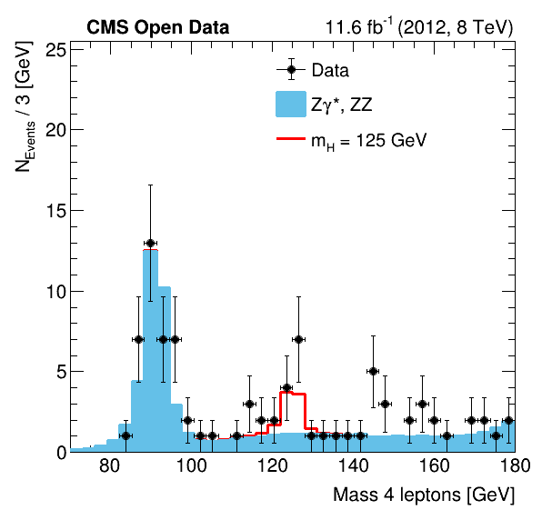
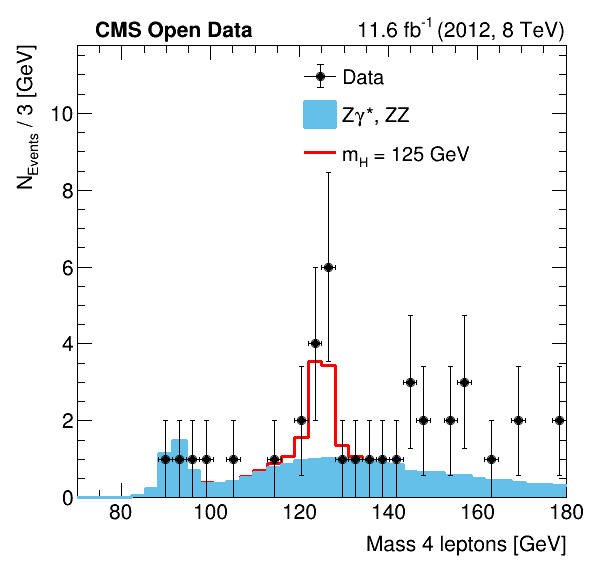

# Analysis of Higgs boson decays to four leptons

## Introduction
This repository contains an analysis of the decay of a
Higgs boson into two Z bosons which in turn decay in four leptons
using reduced NanoAOD files created from [CMS Open Data](http://opendata.cern.ch/record/12360). The analysis follows loosely
[the official CMS analysis published in 2012](https://www.sciencedirect.com/science/article/pii/S0370269312008581). First, the dataset is "skimmed", i.e. all events which are not of interest for the reconstruction
of Higgs bosons are removed, and the various observables necessary for the analysis are computed.
The remaining variables are then plotted and the invariant mass of the four leptons
is fitted in order to measure the Higgs mass.
Subsequently, a Deep Neural Network is trained
using as input the simulated signal and background Monte Carlo samples and as discriminant
variables the invariant masses of the two reconstructed Z bosons and the five angles
formed by the leptons in the final state as described in detail in the article
[[Phys.Rev.D86:095031,2012]](https://journals.aps.org/prd/abstract/10.1103/PhysRevD.86.095031).
Then, the DNN is evaluated on the whole dataset in order to obtain a graph in which the
distribution of the DNN Discriminant versus the invariant mass of the four leptons is plotted.
This shows a clear separation between signal and background, hence a further cut on the data based on this discriminant can be
applied in order to obtain a "cleaner" sample and better discriminate the signal from the background.

## How to run this

### Run the analysis
The complete analysis can be performed the first time by simply running

>       python run_analysis.py -d

which also downloads the locally the input datasets.
Some general purpose functions to set up the analysis are defined in
the `set_up.py` file.

The several options for running the analysis may be displayed by typing

>       python run_analysis.py --help

The options include:

>     -d [DOWNLOAD], --download [DOWNLOAD]     enables the download of input data. If not specified otherwise the files are saved in the 'Input/' directory
>     -e, --typeOfParallel  parallel type for the downloads: default is multi-thread, if activated is multi-process
>     -c [CLEAROUTPUT], --clearOutput [CLEAROUTPUT]       name of output folder to be deleted. If not specified otherwise the 'Output/' directory is deleted
>     -q, --skim            disables the skimming step
>     -r [RANGE], --range [RANGE]      number of events on which the analysis is ran over (does not work in parallel)
>     -p, --parallel        disables running in parallel
>     -n NWORKERS, --nWorkers NWORKERS        number of workers
>     -l LOGLEVEL, --logLevel LOGLEVEL        integer representing the level of the logger: DEBUG=10, INFO = 20, WARNING = 30, ERROR = 40
>     -f FINALSTATE, --finalState FINALSTATE      comma separated list of the final states to analyse: FourMuons,FourElectrons,TwoMuonsTwoElectrons
>     -m, --ml              disables machine learning algorithm
>     -a MLVARIABLES, --MLVariables MLVARIABLES      name of the set of variables to be used in the ML algorithm defined 'variables_ml_def.py': tot, higgs
>     -i, --invariantMassFit       disables fit of the Higgs mass
>     -g, --graphPlots      disables the graphing of the distribution plots
>     -t TYPEDISTRIBUTION, --typeDistribution TYPEDISTRIBUTION        comma separated list of the type of distributions to plot: data, background, signal, sig_bkg_normalized, total
>     -s SAMPLE, --sample SAMPLE       string with comma separated list of samples to analyse: Run2012B_DoubleElectron, Run2012B_DoubleMuParked, Run2012C_DoubleElectron, Run2012C_DoubleMuParked, SMHiggsToZZTo4L, ZZTo2e2mu, ZZTo4e, ZZTo4mu
>     -v VARIABLEDISTRIBUTION, --variableDistribution VARIABLEDISTRIBUTION       string with comma separated list of the variables to plot. The complete list is defined in 'variables_def.py'
>     -b [BASEPATH], --basePath [BASEPATH]      base path where to find the input data. If enabled it automatically gets the input data from EOS unless a local directory is specified
>     -o OUTPUT, --output OUTPUT     name of the output directory

Some of the options above are applicable even to the single steps shown in the sections below.

The analysis can be performed even on just a specific sample and/or final state by running

>       python run_analysis.py -s SMHiggsToZZTo4L -f FourElectrons

### Download of the input datasets

The datasets can be downloaded locally by running

>       python download.py -d DirectoryName

If not specified otherwise, datasets are saved in the directory `Input/`. The option `-p`
disables parallel running, while the option `-e` lets the users choose between
multithreading (default) or multiprocessing.

### Skimming

The skimming process consists in reducing the initial samples to a dataset
specific for this analysis. The skimming removes all events
which are not of interest for the reconstruction of Z bosons
from combinations of leptons, which may originate from the
decay of a Higgs boson. Furthermore, all the variables used
later on are defined in this step. This includes mass, Pt, eta and phi of Z and Higgs
bosons, as well as the five decay angles mentioned above
which are later used for a machine learning algorithm.

The skimming step can be performed by running

>       python skim.py

The option `-r` lets the user select the number of events on which the analysis is run.
The functions used in the skimming step of the analysis are defined
in the `skim_tools.py` file.
The basic functions used on the data are defined in `skim_functions.h`.

### Machine learning

In this step a Deep Neural Network (DNN) is trained on the Monte Carlo samples
of signal and background. The training is done thanks to the ROOT.TMVA library
with keras API. The trained DNN is evaluated on the various datasets and the events
with discriminant above threshold are saved in a new TTree. Such threshold is set to the optimal cut-value with highest $S/\sqrt{S^2+B^2}$ ratio as seen in the figure.

The training, application and selection steps can be performed by running

>       python ml_training.py
>       python ml_evaluation.py
>       python ml_selection.py

The option `-a` gives the user the possibility to train the DNN using as discriminant variables
Z1_mass, Z2_mass, cos_theta_star, Phi, Phi1, cos_theta1, cos_theta2 (`-a tot`) or Higgs_mass (`-a higgs`).
The latter is not really a useful option, since the discrimination is based entirely on the mass of the
Higgs candidate, but it's more of an extra. The training history and the ROC curve are displayed in the figures below.

### Histogramming
The histogramming step produces histograms for each variable in each dataset by running

>       python make_histo.py

The option `-v` lets the user select which variables are going to be plotted.

By running

>       python ml_histo.py

2D histograms of Higgs_mass vs DNN Discriminant
are created, one for the combination of all the simulated background,
one for all the simulated signal and one for each possible final state
of the data.

The functions used in the histogramming step are defined in `histogramming_functions.py`.

### Plotting
The plotting combines the histograms to plots which allow to study the
inital dataset based on observables motivated through physics.
The plots for each variable are created by running

>       python make_plot.py

The option `-v` lets the user select which variables to plot.
In the figures below it's shown the distribution on the 4 leptons invariant mass
with and without the selection based on the DNN Discriminant.

<table align="center" border="0">
  <tr>
    <td style="text-align:center">Higgs mass without DNN selection</td>
     <td style="text-align:center">Higgs mass with DNN selection</td>
  </tr>
  <tr>
    <td></td>
    <td></td>
  </tr>
</table>

By running

>       python ml_plot.py

2D scatter plots of Higgs_mass vs DNN Discriminant
are created, one for the simulated background and one for the
simulated signal. Each one of the plots shown below contains both the combination
of all background/signal datasets and the real data
separated in the three possible final states.

<table align="center" border="0">
  <tr>
    <td style="text-align:center">Higgs mass without DNN selection</td>
     <td style="text-align:center">Higgs mass with DNN selection</td>
  </tr>
  <tr>
    <td><embed src="Output_complete/Discriminant_plots/discriminant_background.pdf" alt="Higgs mass without DNN selection" title="Higgs mass without DNN selection" width="400" height="400" type="application/pdf"></td>
    <td><embed src="Output_complete/Plots/DNNSelection/total/total_Combined_Higgs_mass_DNNSelection.png" alt="Higgs mass with DNN selection" title="Higgs mass with DNN selection" width="400" height="400"></td>
  </tr>
</table>

The functions used in the plotting step are defined in `plotting_functions.py`.

### Higgs mass fit
The mass of the Higgs candidate is fitted with a Crystal Ball.
A fit on the simulated samples and a fit on the data
(estimating the background from the MC) are performed.

The fit is performed by running

>       python fit_mass.py
